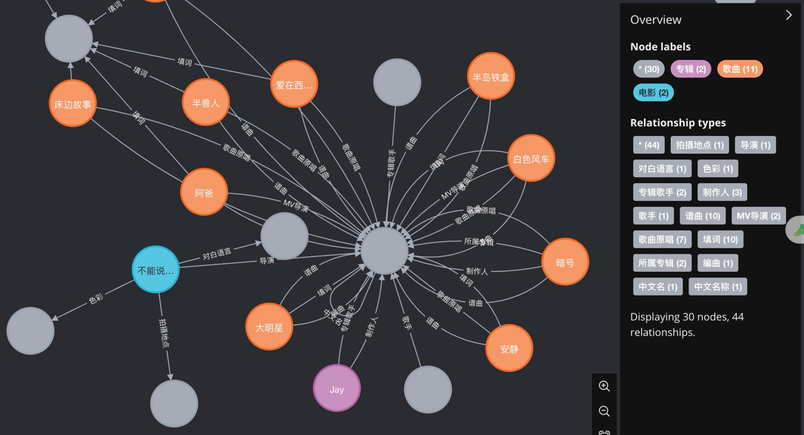
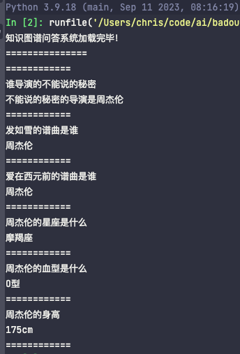

# 项目实现
## 1. 描述
基于py2neo+neo4j实现知识图谱问答系统
## 2. 环境安装(mac系统)
### 2.1 安装neo4j
```bash
brew install neo4j
```
安装python库
```bash
pip install py2neo
```
## 3. 运行可能存在的问题
当安装的版本较新时，运行graph = Graph("http://localhost:7474", auth=("neo4j", "neo4j"))可能报错，请尝试将`http://localhost:7474`换成`bolt:\\localhost:7687`
## 4. 项目概览
### 4.1 图展示

### 4.2 知识图谱问答
